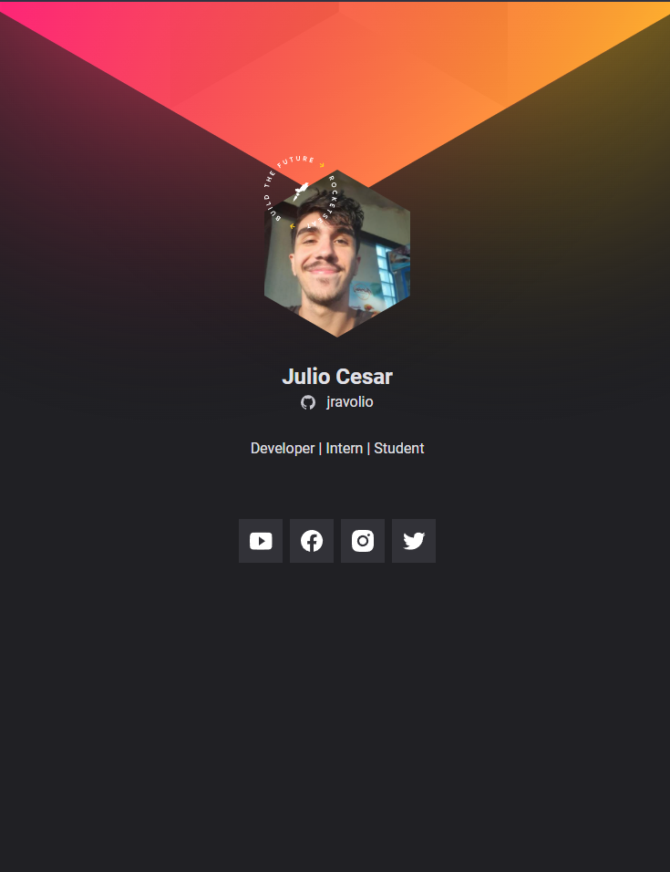

## - Objective ♟ 
 this project is a site on a badge style, developed with the help of the Rocketseat classes. This project can easily be modified to fit any github profile it will get the bio, the name and the photo from your github profile, to access the site example you can [CLICK HERE](https://jravolio.github.io/nlw-origin/)



## - How to setup ⛏
 Follow these steps =>
 
 1 - fork this project
 
 2 - access "main.js"
 
 3 - change the following variables with the respective username in the social, this is on line 1 to 7:
  
  ```
const linksSocialMedia = {
    github: '{username_github}',
    twitter: '{username_twitter}',
    facebook: '{username_facebook}',
    instagram: '{username_instagram}',
    youtube: '{username_youtube}'
   }
```
4 - make this project online using github pages or other host service

 5 - ready! :)

# Portuguese :brazil:
##  - Objetivo ♟
 O projeto é um site no estilo crachá desenvolvido a partir das video-aulas da Rocketseat que pode ser adequado para qualquer pessoa que possua uma conta no github obtendo foto de perfil, bio e nome diretamente do github. Para acessar o site de exemplo [CLIQUE AQUI](https://jravolio.github.io/nlw-origin/)
 
 ##  - Como utilizar ⛏
 para adequar o site para o seu perfil siga os seguintes passos =>
 
 1 - fork esse projeto
 
 2 - acesse o aquivo "main.js"
 
 3 - modifique o nome das variáveis entre chaves para o nome do seu respectivo usuário em cada uma delas na seguinte parte do código entre as linhas 1 e 7:
 
 ```
const linksSocialMedia = {
    github: '{username_github}',
    twitter: '{username_twitter}',
    facebook: '{username_facebook}',
    instagram: '{username_instagram}',
    youtube: '{username_youtube}'
   }
```
4 - suba o projeto para o github pages ou algum outro serviço de hospedagem

5 - pronto! :)
